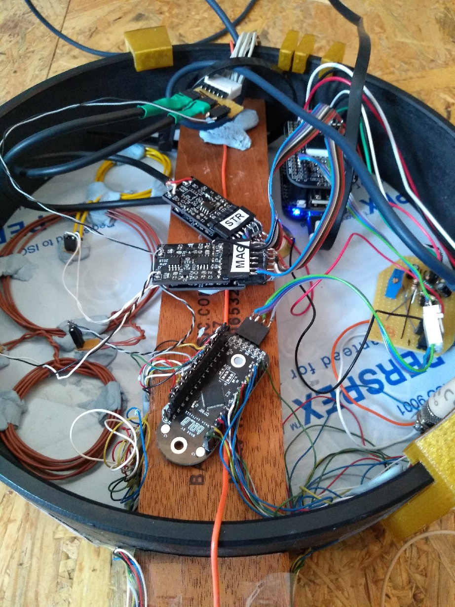
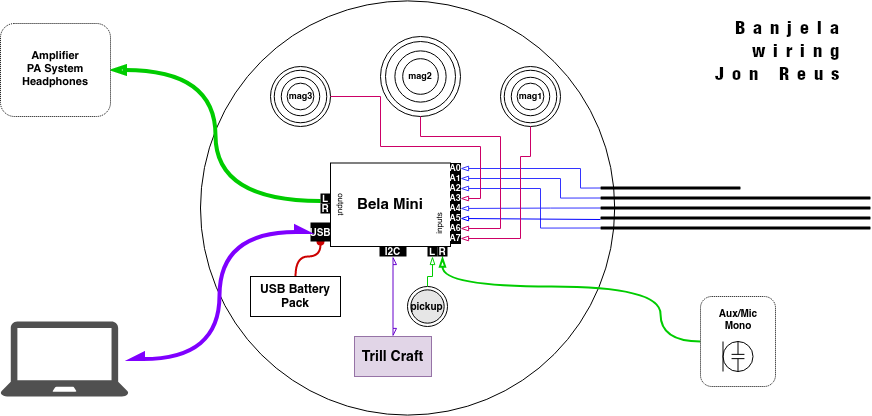

# Hacking the Five-String Banjo
In the summer of 2019 I was graciously received by Andrew McPherson and the whole Augmented Instruments Lab at C4DM for a series of micro-residencies. I've had a longstanding interest in "old time" American folk music since getting wrapped up in that musical world a lifetime ago when I lived and worked in Northern Florida.

Florida is the state where, the farther north you go, before you know it, you're in The South. A lot of that hands-on, material/social-oriented cultural ethos still sticks with me in the way that I approach digital music. It has always fascinated me the ways in which American folk instruments and music transformed historically through twisting evolutionary paths, geographic enclaves and waypoints, and heterogeneous mixtures of cultural attitudes towards music and instrumentality.

<figure>

<figcaption></figcaption>
</figure>


The American banjo is an interesting example of that. It's an instrument that's the result of a confluence of cultures and is representative of a complex history with extremes of deep inequalities based on race and class at one end, and the ambitions of elites and industrialists at the other.

The banjo has a complicated relationship to technological innovation as well. During a period in the 19th century there were certain (white) entrepreneurs who, many through a combination of musical idealism and business opportunism, wanted to... for lack of a better term, "rescue" the banjo from its reputation as a crude and vulgar instrument (a reputation strongly linked to its association with African music). The modern elite of the time connected notions of civility with high levels of technology. So there was a push by many entrepreneurial luthiers to "civilize" the banjo by adding more machinic refinement. This is the time when the American banjo started morphing from all-wooden or gourd-based designs to the metal tone rings and steampunk-esque tension brackets that you see today.

There are still specialty luthiers out there making "mountain" banjos, which is kind of a catch-all for any kind of banjo-like instrument made from wood or gourd, smaller and varied pot sizes, fretless and fretted, often home-made.

<br>

<figure>

<figcaption>Five-string fretless banjo, src: [National Museum of American History](https://www.si.edu/object/five-string-fretless-banjo:nmah_605678)</figcaption>
</figure>

<!-- img src="./banjo_history_harpers.jpeg" width=300 -->
<!-- While some European Americans were working to "civilize" the banjo through technological enhancement, at the same time there was a trend in white America that embraced the "uncivilized" image of the banjo, presenting it as the perfect parlor instrument for the idealized upper class woman; whose whims and emotional storms fit such an "untamed" instrument. -->

-------------------

# Belanjo or Banjela?


I had started sketching out plans for a prototype electric/programmable mountain banjo a few months before coming to London. I was mainly interested in exploring how to build digital extended techniques that could expand on "stroke" styles. "Stroke" styles are a stringed instrument playing technique where the player strokes down with the back of their fingernails on to a melody string and then pulls up with the thumb on another string (usually tuned as a drone). People often refer to this kind of playing as "frailing" or "clawhammer", but the origins of this playing approach, much like the origins of the banjo itself, are rooted in African musical techniques on spiked-lute instruments like the ekonting (see [Daniel Jatta](https://www.youtube.com/watch?v=lzt0v9roU6g)) or the Gimbri used in Gnawa music (see [Yassir Chadly](https://www.youtube.com/watch?v=WsGgkt2OpSQ)).

---
<figure>

<figcaption>Partly assembled banjo with wooden head and 3D-printed brackets used for holding the whole neck+pot+head assembly together without glue.</figcaption>
</figure>

I found a lovely little "mountain banjo" kit from the luthier shop [Backyard Music](https://www.backyardmusic.com/banjos.html). I chose the backyard music kit because, unlike most banjos, it doesn't have a drum skin head, but rather a very thin piece of wood that can easily be modified or swapped out for other materials. It also sounds surprisingly good, has a full-size neck, and can handle steel strings without a problem (really important for the magnet-based pickup design I used).

---

# Right Hand Technique

<figure>

<figcaption>Dana Immanuel and I in the studio at C4DM</figcaption>
</figure>

When I used to work at <a href="https://en.wikipedia.org/wiki/STEIM">STEIM</a> in Amsterdam, we would often talk about finding the "core" of your instrument and building an extended practice from there. For stroke-style, the core is the right hand and being in the pocket of its rhythm. Stroke techniques are sometimes called "knocking", because of the way you knock on the head of the banjo like knocking on a door. It's a more or less constant motion and you don't want to 'break rhythm'.

While in London I teamed up with banjo diva Dana Immanuel, of [Dana Immanuel and the Stolen Band](http://danaimmanuel.com/), to experiment with possibilities for extended right hand techniques.

More skilled banjoists like Dana like to work the right hand at different positions up and down the pot and the neck while playing to vary the timbre and make the banjo stand out when it needs to, or to move emphasis from rhythm to melody. There is an especially important sweet spot for frailing near the 19th fret of most banjos (sometimes accompanied by a scoop carved into the neck). This is the location of some of the banjo's noisiest natural harmonics, and is used for extra oomph when ["clucking"](https://www.youtube.com/watch?v=xtLhXkV17fQ), a technique where the down stroke of the right hand plays a sort of muted harmonic slap across the strings to vary up the rhythmic emphasis.

More generally, the closer the right hand is to the bright, the more upper harmonics, creating a more cutting, twanging timbre. Pro frailing banjo players like Dana work the timbre constantly as they play to vary up tonality and make the banjo stand out more when it needs to, or to move emphasis from rhythm to melody.

---

# Trill and Magsense

From here it was pretty clear that an old-time knocking banjo player has a good amount of free bandwidth in their right hand that could be built upon.

To do this I leveraged two technologies that were being prototyped at the Augmented Instruments Lab, the touch-sensing Trill and the magnetic-field sensing tech used to sense guitar picking motions in the Magpick.

The magpick sensors were integrated into the head of the banjo to track frailing motions and knocking, while custom-made trill touch inlays were positioned at different places along the pot and lower part of the neck to function like extra strings, above the 5th and below the 1st.

Since I'm using SuperCollider for all my live electronic sound needs, I needed to develop some [custom UGens](https://github.com/jreus/Trill_SC) for the Bela to be able to get the Trill sensor's data into my signal chains.

<figure>

<figcaption>Dana testing potential locations for magsense hot spots and Trill inlays.</figcaption>
</figure>

<figure>

<figcaption>Inside of the pot of a later version of the protoype, with sensor coils on the back of the head.</figcaption>
</figure>

---
# Sketching Trill Inlays

From the first time the Bela team introduced me to Trill I started thinking about making touch-responsive copper inlays for the banjo. I'm a big fan of the inlay work done on 19th century American folk instruments and furniture, and the kinds of ornamentation that was popular during the [American Fancy movement](https://en.wikipedia.org/wiki/American_Fancy). I had an Architect friend who told me once that modernist aesthetics have caused us to collectively forget how to be ornamental. I tend to agree. Let's imagine a digital future for ornamentation.

After designing some paper prototypes, taped to the banjo and testing the ergonomics of these along with Dana, I moved on to making some copper stick-on inlays using a vinyl cutter and copper foil.

I also used the C4DM's laser cutter to fashion a new head for the banjo from blue acrylic, featuring some ornamental patterns inspired by the Fancy aesthetic.

<figure>

<figcaption>Acrylic drum-head fresh off the laser cutter at the C4DM's materials lab.</figcaption>
</figure>

<figure>
<br>
<figcaption>First copper inlays made on the vinyl cutter.</figcaption>
</figure>

To attach the inlays I first transferred the cut foil to a piece of thin acetate using transfer tape. Once on the acetate each inlay segment was (carefully!) soldered to a thin-gauge piece of hookup wire. Finally, the whole thing gets 'sealed' to the acetate using a piece of transparent packing tape. The packing tape layer has the double benefit of both holding the assembly together and providing an extra thin layer of isolation on the copper, which makes the sensor response more linear when you attach it to a Trill craft board.

After cutting out the sensor sandwiches from the acetate sheet they're then attached to the banjo using some double sided tape.

This works for now as a proof of concept and playability. For the future I'm still torn between either designing these as flex sensors and running a ribbon connector down the neck, or milling them out of copper plate and mounting the wires behind each segment. In either case, I'd like to give my router and chisel skills a brush up and set them into the neck.

<br>
<figure>


<figcaption>Inlay prototypes mounted on the banjo neck and rim</figcaption>
</figure>

---

# Going Electric

Now how about amplifying those strings? One thing I really love about stroke-style playing is the expressive dynamic variation most players put into it. Give a listen to [this recording of Sourwood Mountain](https://www.youtube.com/watch?v=TrOv7qHgo3k) performed by Boone Reid. The dynamics ebb and swell, even on a per-string basis. Contrast this against the much more widely known 3-finger "Scruggs-style" techniques used in bluegrass and a lot of modern jazz-inspired banjo playing. These more modern banjo techniques are played using metal finger picks and produce a punchier, more consistent dynamic level (along with higher speed and precision). I feel the Scruggs-like styles have dynamics like a freight train. While stroke style is like a rain storm, more diffuse and temperamental.

At the C4DM Andrew introduced me to the work of [Laurel Pardue](https://scholar.google.com/citations?user=UXWpcQ4AAAAJ), one of the researchers at the Augmented Instruments Labor and electronic luthier par excellence. In her svampolin, a hybrid digital/acoustic violin, she uses a quirky electric pickup system based on Michael Edinger's [StringAmp](https://www.stringamp.com/stringamp/) which has a couple exciting features like per-string amplification and a non-invasive design. Signals are picked up at the tail end of the instrument from the strings and created by placing fixed magnets in close proximity to where each string vibrates. It's a bit like an inversion of the classic electric guitar pickup design.

Getting the pickup system to work was a lot of trial and error, and required learning a bit of basic lutherie to remove some frets and fashion a new tail from a bone blank. For the moment the fixed magnets are embedded into a wooden frame so they can be easily adjusted to different locations. In the future I'm looking to embed them into the neck, as they're currently occupying an inconvenient space where the neck meets the pot - an important spot for the right hand to be able to play.

<figure>
<video>
  <source src="./pickup_magnet_placement.m4v" type="video/mp4">
</video>
<figcaption>Experimenting with signal strength and interference with different magnet placements.</figcaption>
</figure>
<a href="./pickup_magnet_placement.m4v">Video: experimenting with magnet placement</a>


<br>

<figure>

<figcaption>Lasercut frames to experiment with non-destructive mounting of different magnet sizes.</figcaption>
</figure>

<br>
<figure>

inputs

<figcaption>Installing a bone tail to replace the conductive fret built into the kit.</figcaption>
</figure>


<br>
<figure>

<figcaption>Modified hoop-string tail system for picking up signals from the strings.</figcaption>
</figure>

---

# What's Inside

Inside the banjela is a Bela mini with analog inputs used to full capacity: five independent signals (one for each string pickup) going into the Bela's first 5 analog inputs, three magpick sensors going into the remaining 3 analog inputs, and the copper inlay sensors wired to a Trill craft, connected to the Bela mini via I2C.

<figure>

<figcaption>Banjela backside, here shown plugged into a laptop via USB for reprogramming</figcaption>
</figure>

The whole thing is a stand-alone hybrid electronic instrument, powered by an off-the-shelf USB power bank. There's a single stereo 3.5mm headphone jack output that combines the banjo's acoustic signal with reprogrammable DSP and synthesis, written using the SuperCollider music programming language. The banjo can be reprogrammed live, or live coded, if you hook it up to a laptop via USB.

---


# Acoustic Signals: Voice and Pickups

The Bela mini's highest quality audio comes in through the main stereo inputs, which go to a specialty audio codec chip instead of the lower quality ADCs used by the 8 general purpose analog inputs. I reserved these two channels for capturing the acoustic sound of the banjo.

One stereo input is dedicated to a piezo pickup attached to the banjo's head right behind the bridge. This allows for creating a mix between the acoustic sound and electric pickups in software. The second channel of the stereo input is left open to plug in whatever you like - opening up the possibility of feeding instrument signals from other musicians into the banjo for analysis and processing.

I was most interested in using this second input for live sampling and processing of voice. American folk music tradition nearly always involves vocalizing in as many ways as there are individuals. Hollars and work songs are remixed into gospel and blues. What European music calls "untrained" is more a deafness to the connection between music and lived experience. Singing is part of living anyway.

I built a combined pre-amp circuit (powered by the Bela mini) that provides a high-Z interface for the piezo pickup and also a powered input for electret microphones. For voice work while playing, there are a number of affordable head-mounted condenser microphones, or you can build your own. I've been using the [t.bone Headmike](https://www.thomann.de/intl/the_tbone_headmike_o_ew.htm), which is a discount model designed to be compatible with Sennheiser "EW" wireless mic systems. Most of these microphones need a bit of power to work ~ the Bela Mini's 3.3V supply is just enough, fed through a 2.2kΩ resistor.

<figure>


<figcaption>Stereo input pre-amp and mic power circuit</figcaption>
</figure>

---

# Embedded Processing: A Bird's Eye View

That's a lot of signals going in and out of that little Bela mini. Wouldn't it be nice to see what's coming in from the banjo somehow?

Around the time when I was doing my residency the Bela team had just released a new browser-based GUI system. Using the Bela GUI example sketches for the Trill sensor I built out a GUI to keep track of all the incoming signals into the Bela from the Banjo. This meant building a couple new GUI widgets. One widget for the Trill craft, that could be broken up into multiple segments in the configuration I was using it. And a second custom widget to represent real-time audio waveforms - kind of like an oscilloscope.

All in all I had the following that needed to be represented:
* one microphone signal
* one piezo pickup acoustic signal
* five audio signals, one for each of the five strings
* three magpick sensors on the head
* one trill craft broken into five segments  (two long segments on the bottom of the neck, one on the top by the thumb, and two small segments on the pot)


<div style="padding:56.25% 0 0 0;position:relative;"><iframe src="https://player.vimeo.com/video/413710173?byline=0" style="position:absolute;top:0;left:0;width:100%;height:100%;" frameborder="0" allow="autoplay; fullscreen" allowfullscreen></iframe></div><script src="https://player.vimeo.com/api/player.js"></script>
<a href="https://vimeo.com/413710173">Banjela GUI Interface demo</a>

---

# Sound Design and Songwriting

<figure>

<figcaption>Songwriting and soundmaking at the C4DM studio</figcaption>
</figure>

For a first attempt at songwriting for this instrument I made a suite of three songs, each exploring different extended techniques.


<div style="padding:56.25% 0 0 0;position:relative;"><iframe src="https://player.vimeo.com/video/414719601?byline=0" style="position:absolute;top:0;left:0;width:100%;height:100%;" frameborder="0" allow="autoplay; fullscreen" allowfullscreen></iframe></div><script src="https://player.vimeo.com/api/player.js"></script>
<a href="https://vimeo.com/414719601">Banjela percussion techniques video</a>

Mapping and sound synthesis in this case was a pretty elaborate process, a bit too much to get into here. Below is some DSP code that shows off a couple of these sound design tactics, like mapping the Trill segments above and below the lower part of the neck to act like additional strings (connected to a string physical model), and using the magpick sensors on the head of the banjo to control forward/backwards sample playback of percussion instruments.

<figure>

<figcaption>Waveform of a single right-hand stroke captured by the magpick sensor. This signal gets mapped to forward and backward sample playback.</figcaption>
</figure>


```

~smpl_path = "/usr/local/share/SuperCollider/sounds/a11wlk01.wav";
~buf = Buffer.read(s, ~smpl_path);
~in = (mic: 3, pickup: 2, s1: 6, s2: 9, s3: 8, s4: 5, s5: 4, m1: 11, m2: 10, m3: 7);
~tr = ( // trill segment ranges
	ntop: [0.01, 0.3104], slide: [0.5171, 0.7242], nbottom: [0.7579, 0.8621],
	rimtop: [0.3447, 0.4138], rimbottom: [0.8964, 0.9311],
	i2c_bus: 1,
	i2c_addr: 0x38,
	noiseThresh: 30, // int: 5-255 with 255 being the highest noise thresh
	prescalerOpt: 1, // int: 0-4 with 0 being the highest sensitivity
);

~jo = {
	var strings, mag2, trill, touch0, vstringtop, vstringbottom, smpl, mix;
	var buf, bframes, spos;
	var t_top, t_bottom, t_mag;
	strings = In.ar(~in.pickup, 1);
	mag2 = In.ar(~in.m2,1);
	trill = TrillCentroids.kr(~tr.i2c_bus, ~tr.i2c_addr, ~tr.noiseThresh, ~tr.prescalerOpt);

	// virtual plucked strings on top and bottom of Banjela neck
	t_top = (trill[2] > 10) * (trill[1] >= ~tr.ntop[0]) * (trill[1] <= ~tr.ntop[1]);
	t_bottom = (trill[2] > 10) * (trill[1] >= ~tr.nbottom[0]) * (trill[1] <= ~tr.nbottom[1]);

	touch0 = [Gate.kr(trill[1], t_top), trill[2]]; // pos, size
	vstringtop = Resonz.ar(Pluck.ar(PinkNoise.ar, Changed.kr(t_top), 0.2, touch0[0].linexp(~tr.ntop[0], ~tr.ntop[1], 50, 1000).reciprocal, 25.8, 0.5, mul: 6.0), [60, 300,2200], 0.1, 10.0).clip;

	touch0 = [Gate.kr(trill[1], t_bottom), trill[2]]; // pos, size
	vstringbottom = Resonz.ar(Pluck.ar(PinkNoise.ar, Changed.kr(t_bottom), 0.2, touch0[0].linexp(~tr.nbottom[0], ~tr.nbottom[1], 100, 2000).reciprocal, 20.8, 0.4, mul: 6.0), [90, 1300,3200], 0.1, 10.0).clip;


  // mag signal mapping to sample playback
  buf = ~buf;
  bframes = BufFrames.kr(buf);
  mag2 = Lag2.ar(mag2, 0.1).linlin(-0.02, 0.02, -1.0, 1.0);
  t_mag = Trig1.kr(mag2.abs > 0.4, 0.1);
  mag2 = mag2.abs.explin(0.4, 1, 0.2, 0.05);
  spos = EnvGen.ar(Env.new([0, 0, 1], [mag2, 1.0], \lin), t_mag, bframes, 0, BufDur.kr(buf));
  smpl = BufRd.ar(1, buf, spos, 0.0, 2);

  // Signal Chain
  mix = Mix([smpl, vstringtop, vstringbottom, strings]);
  mix = Limiter.ar(LeakDC.ar(mix), 1.0, 0.001);
  mix * 1.0;
}.play(s, outbus: 0, addAction: \addToTail, fadeTime: 0.01);

```

---

<figure>

<figcaption>Performing with the Augmented Instruments Lab and Kuljit Bhamra at <a href="https://iklectikartlab.com/">IKLECTIC</a> in London
</figure>

---

This work was done with a support grant from the <a href="https://stimuleringsfonds.nl/en/">Dutch Creative Industries Fund</a>
<a href="https://stimuleringsfonds.nl/en/"></a>


# Bio

Jonathan Reus is a Dutch-American composer-researcher, born in Manhattan NY and thereafter raised in Amsterdam and then Florida, where he became involved in the American folk-art scene. Years later he moved to the Netherlands where he worked at the adventurous performance-technology lab [STEIM](https://en.wikipedia.org/wiki/STEIM), developing a uniquely intimate practice cutting across the disciplines of music, performance art, science and digital culture. His work uses collages of technologies past and present to reflect the simultaneous times and histories we inhabit.

He has received commissions as a composer, performer and installation artist by Slagwerk Den Haag, Stedelijk Museum Amsterdam, Club Guy & Roni and Asko-Schönberg ensemble. Most recently he composed the music for and built a large-scale tape machine instrument for the nationally-touring production Brave New World 2.0, based on Aldous Huxley's dystopian novel.


In addition to his artistic work, Jonathan has tirelessly demonstrated his support for local, bottom-up artistic initiatives and novel artist-education formats through curation and community organization. Since 2013 he has worked as a founding member of the non-profit cultural initiative [iii](https://instrumentinventors.org/) in The Hague. From 2015-2019 he organized and curated [The Reading Room](https://platformtm.tumblr.com/), at STROOM Den Haag. In 2017 he organized the first Berlin-based Algorave at transmediale festival, along with the performance program The Instrumental Subconscious, showcasing experimental musicians working with self-made instruments. And in 2016 he helped to design the Digital Media bachelors program at Leuphana University's Center for Digital Cultures, where he won the teaching prize for cross-disciplinary education for his courses on computational literacy through sound and body.

Jonathan is an experienced researcher in the field of electronic music instruments and sonic interaction design. He recieved the W. J. Fulbright fellowship for his work in the research of new digital instruments for music. He has also lectured on the topic of performative sound and technological mediation at academies of art and design, music conservatories and universities.

https://jonathanreus.com/

---
