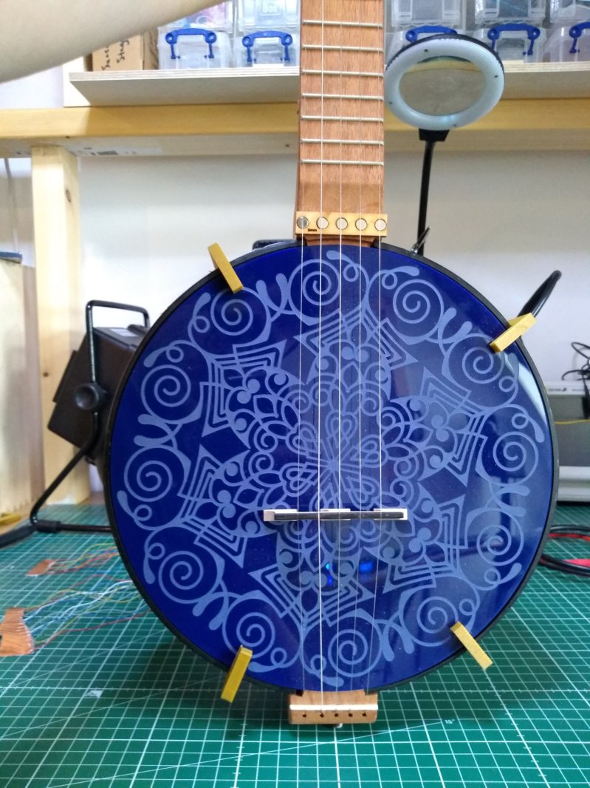
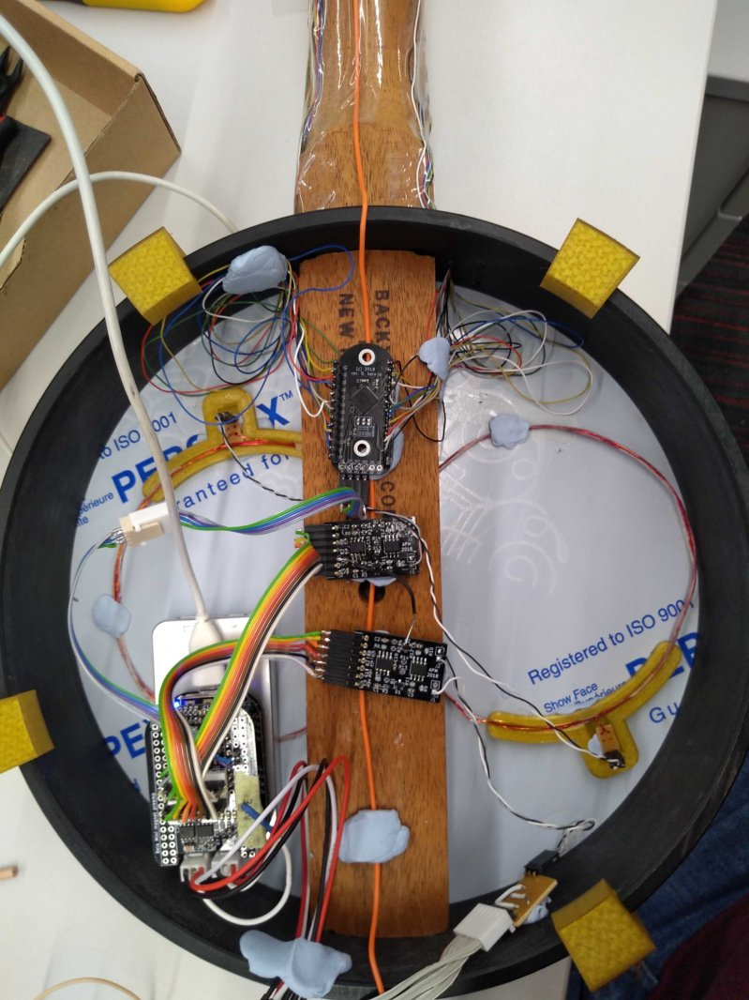

# Electric Folkways
In the summer of 2019 I was graciously received by Andrew McPherson and the whole Augmented Instruments Lab at C4DM for a series of micro-residencies, aimed at kick-starting a new music project combining live electronics and sonic elements from the old, weird American music landscape. I've had a longstanding interest in American folk music histories since getting wrapped up in that musical world a lifetime ago when I lived and worked in Northern Florida. Florida is the state where, the farther north you go, before you know it, you're in The South.

Back then I really embraced every aspect of American folk art, and a lot of that hands-on, material/social-oriented cultural ethos still sticks with me in the way that I approach digital music. It has always fascinated me the ways in which American folk instruments and music transformed historically through twisting evolutionary paths, geographic enclaves and waypoints, and heterogeneous mixtures of cultural attitudes towards music and instrumentality.

-------------------

# Belanjo Banjela

I originally started talking to Andrew about building a prototype electronic "mountain banjo" some months before my residency started. I was mainly interested in exploring how to build digital extended techniques based on "old time", or "stroke" styles. I had a couple specific ideas: one was to see what could be done with the new trill sensors that were at the time under development, to build right-hand extensions into the body of the banjo. The other was to electrify the strings using a clever pickup design that was being used by another AIL researcher, Laurel Pardue, on the svampolin, a hybrid digital/acoustic violin she was designing. All of this would then go into a Bela embedded inside the pot of the banjo with a single stereo output.  

---

For the first experiments I found a lovely little "mountain banjo" kit from the luthier shop [Backyard Music](https://www.backyardmusic.com/banjos.html). These kits are especially nice for prototyping because of their all-wood construction and absence of a drum skin-head. They have a little scoop in the neck for stroke style playing and also sound surprisingly good.

"Stroke" styles are an interesting stringed instrument playing technique where the player strokes down with the back of their fingernails on to a melody string and then pulls up with the thumb on another string (usually tuned as a drone). The technique has its roots in the West African instrument makers/players who were brought to the American South as slaves. Some of these original instrument traditions still exist ~ e.g. in the akonting of the Jola people (see [Daniel Jatta](https://www.youtube.com/watch?v=lzt0v9roU6g) for example).

One lovely thing about a lot of stroke-style playing is the expressive dynamic variation most players put into it. Give a listen to [this recording of Sourwood Mountain](https://www.youtube.com/watch?v=TrOv7qHgo3k) performed by Boone Reid. The dynamics ebb and swell, even on a per-string basis. Contrast this against the much more widely known 3-finger "bluegrass" style, played using fingerpicks, which has a much punchier, more consistent dynamic level. You could say 3-finger style has the dynamics of a freight train. While stroke style is more like a rain storm.

In electrifying the banjo I was looking for a way of getting independent signals for each string so as to be able to take advantage of this dynamic control, and use it for triggering electronic sounds on a per-string basis. The pickup system based on Michael Edinger's [StringAmp](https://www.stringamp.com/stringamp/) allows for separated string amplification and a non-invasive design, with signals picked up at the tail end of the instrument and the potential to mount signal-inducing magnets at the point where the neck meets the pot.

---

# Right Hand Technique

Ergonomics experiments and impromptu banjo lesson from London-based banjoist/singer/songwriter Dana Immanuel, of [Dana Immanuel and the Stolen Band](http://danaimmanuel.com/).

Capacitive touch inlays made on the vinyl cutter.

---

