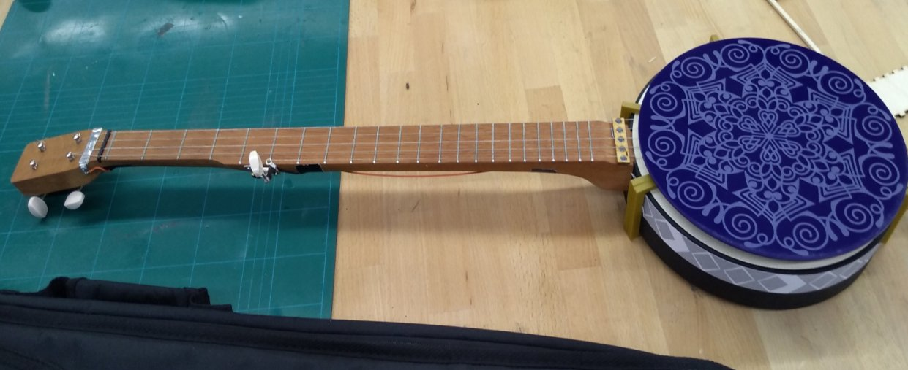
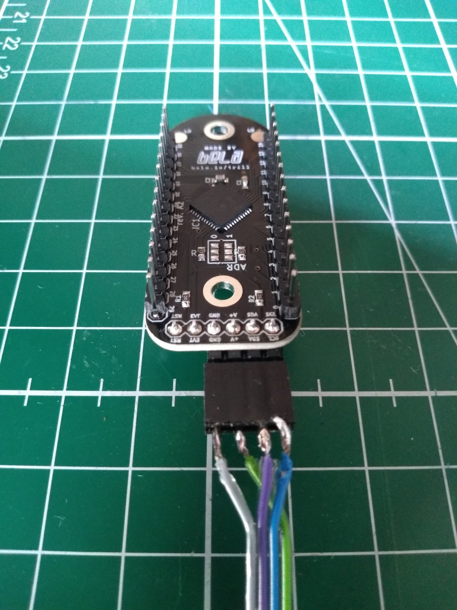

# Electric Folkways
In the summer of 2019 I was graciously received by Andrew McPherson and the whole Augmented Instruments Lab at C4DM for a series of micro-residencies, aimed at kick-starting a new music project combining live electronics and sonic elements from the old, weird American music landscape. I've had a longstanding interest in American folk music histories since getting wrapped up in that musical world a lifetime ago when I lived and worked in Northern Florida. Florida is the state where, the farther north you go, before you know it, you're in The South.

Back then I really embraced every aspect of American folk art, and a lot of that hands-on, material/social-oriented cultural ethos still sticks with me in the way that I approach digital music. It has always fascinated me the ways in which American folk instruments and music transformed historically through twisting evolutionary paths, geographic enclaves and waypoints, and heterogeneous mixtures of cultural attitudes towards music and instrumentality.


An example of an 1800's era banjo advert, when the banjo was being transformed to fit the tastes of the modern elite, industrialists who equated civilization with the spread and growth of a technologized society. The banjo, too, needed to be "civilized", the more metal and machinery thrown at it the better. This is the time when the American banjo started sporting a more steampunky design around the pot that is still present today.

<br>


While some European Americans were working to "civilize" the banjo through technological enhancement, at the same time there was a trend in white America that embraced the "uncivilized" image of the banjo, presenting it as the perfect parlor instrument for the idealized upper class woman; whose whims and emotional storms fit such an "untamed" instrument.

-------------------

# Belanjo Banjela


I originally started talking to Andrew about building a prototype electronic "mountain banjo" some months before my residency started. I was mainly interested in exploring how to build digital extended techniques based on "old time", or "stroke" styles. I had a couple specific ideas: one was to see what could be done with the new trill sensors that were at the time under development, to build right-hand extensions into the body of the banjo. The other was to electrify the strings using a clever pickup design that was being used by another AIL researcher, Laurel Pardue, on the svampolin, a hybrid digital/acoustic violin she was designing. All of this would then go into a Bela embedded inside the pot of the banjo with a single stereo output.  

---

For the first experiments I found a lovely little "mountain banjo" kit from the luthier shop [Backyard Music](https://www.backyardmusic.com/banjos.html). These kits are especially nice for prototyping because of their all-wood construction and absence of a drum skin-head. They have a little scoop in the neck for stroke style playing and also sound surprisingly good.

"Stroke" styles are an interesting stringed instrument playing technique where the player strokes down with the back of their fingernails on to a melody string and then pulls up with the thumb on another string (usually tuned as a drone). The technique has its roots in the West African instrument makers/players who were brought to the American South as slaves. Some of these original instrument traditions still exist ~ e.g. in the akonting of the Jola people (see [Daniel Jatta](https://www.youtube.com/watch?v=lzt0v9roU6g) for example).

One lovely thing about a lot of stroke-style playing is the expressive dynamic variation most players put into it. Give a listen to [this recording of Sourwood Mountain](https://www.youtube.com/watch?v=TrOv7qHgo3k) performed by Boone Reid. The dynamics ebb and swell, even on a per-string basis. Contrast this against the much more widely known 3-finger "bluegrass" style, played using fingerpicks, which has a much punchier, more consistent dynamic level. You could say 3-finger style has the dynamics of a freight train. While stroke style is more like a rain storm.

In electrifying the banjo I was looking for a way of getting independent signals for each string so as to be able to take advantage of this dynamic control, and use it for triggering electronic sounds on a per-string basis. The pickup system based on Michael Edinger's [StringAmp](https://www.stringamp.com/stringamp/) allows for separated string amplification and a non-invasive design, with signals picked up at the tail end of the instrument and the potential to mount signal-inducing magnets at the point where the neck meets the pot.

<embed src="./pickup_magnet_placement.m4v" autostart="false" width="500" />

<br>

Lasercut frames to experiment with mounting different sizes of magnets.

<br>

Picking up signals from each string at the tail of the instrument.

<br>

Installing a bone tail to replace the conductive fret built into the kit.

---

# Right Hand Technique


Ergonomics experiments and impromptu banjo lesson from London-based banjoist/singer/songwriter Dana Immanuel, of [Dana Immanuel and the Stolen Band](http://danaimmanuel.com/).

Looking at right-hand technique, I was trying to find ways of integrating sensors into the body of the banjo in a way that would fit into the pocket of stroke-style playing techniques. These kinds of techniques are sometimes called "knocking", because of the way you knock on the head of the banjo like knocking on a door. A special thanks to banjo diva [Dana Immanuel](http://danaimmanuel.com/) for giving me a hands-on introduction to some more advanced stroke-style tricks and for going through the process of ergonomic testing with me.

Another layer to the right hand technique has to do with where the hand is positioned along the strings. For example, "the cluck" is a technique where the right hand activates the natural harmonics of the strings to make a sharp percussive sound. There is a sweet spot near the 19th fret of most banjos for this (usually accompanied by a scoop carved into the neck). In the opposite direction, the closer your right hand plays to the bridge the more overall harmonics come out in the string resonance, creating a more cutting, twanging timbre. Banjoists like Dana like to work this range as they play to vary up tonality and make the banjo stand out more when it needs to, or to move the emphasis from rhythm to melody.

From here it was pretty clear that an old-time knocking banjo player has a good amount of free bandwidth in their right hand that could be leveraged without going into Theremin territory.


---
# Touch-Sensitive Inlays

It could be really nice to have a photo of the earlier prototype with copper tape and then the evolution to the vinyl cut version with maybe a brief explanation of how the sensors work (I can flesh anything out there if you’d like).


Capacitive touch inlays made on the vinyl cutter.








---
# Bird's Eye View

 Then it would be also great to have a screenshot/gif of the debugging interface you built with all the signal visualisations.

 

 


---

# Sound Design and Songwriting

Mapping sample playback to mag sensing on the head of the banjo. Creating a "sixth string" along the upper part of the neck.
```
/*
.----------------------------.
|\  /\  /\  /\  /\  /\  /\  /|
| )(  )(  )(  )(  )(  )(  )( |
|(  )(  )(  )(  )(  )(  )(  )|
███╗   ███╗ █████╗  ██████╗  ██████╗ ██╗███████╗     ██████╗ ███╗   ██╗    ████████╗██╗  ██╗███████╗
████╗ ████║██╔══██╗██╔════╝ ██╔════╝ ██║██╔════╝    ██╔═══██╗████╗  ██║    ╚══██╔══╝██║  ██║██╔════╝
██╔████╔██║███████║██║  ███╗██║  ███╗██║█████╗      ██║   ██║██╔██╗ ██║       ██║   ███████║█████╗
██║╚██╔╝██║██╔══██║██║   ██║██║   ██║██║██╔══╝      ██║   ██║██║╚██╗██║       ██║   ██╔══██║██╔══╝
██║ ╚═╝ ██║██║  ██║╚██████╔╝╚██████╔╝██║███████╗    ╚██████╔╝██║ ╚████║       ██║   ██║  ██║███████╗
╚═╝     ╚═╝╚═╝  ╚═╝ ╚═════╝  ╚═════╝ ╚═╝╚══════╝     ╚═════╝ ╚═╝  ╚═══╝       ╚═╝   ╚═╝  ╚═╝╚══════╝
██████╗ ██╗   ██╗███████╗
██╔══██╗██║   ██║██╔════╝
██████╔╝██║   ██║███████╗
██╔══██╗██║   ██║╚════██║
██████╔╝╚██████╔╝███████║
╚═════╝  ╚═════╝ ╚══════╝
╚═════╝  ╚═════╝ ╚══════╝    ╚══════╝╚═╝╚═╝  ╚═══╝╚══════╝
    ___    ___     ___     ___     _       ___   __  __    ___
   | _ \  | _ \   / _ \   | _ )   | |     | __| |  \/  |  / __|
   |  _/  |   /  | (_) |  | _ \   | |__   | _|  | |\/| |  \__ \
  _|_|_   |_|_\   \___/   |___/   |____|  |___| |_|__|_|  |___/
_| """ |_|"""""|_|"""""|_|"""""|_|"""""|_|"""""|_|"""""|_|"""""|
"`-0-0-'"`-0-0-'"`-0-0-'"`-0-0-'"`-0-0-'"`-0-0-'"`-0-0-'"`-0-0-'

    ___    ___     ___     ___     _       ___   __  __    ___
   | _ \  | _ \   / _ \   | _ )   | |     | __| |  \/  |  / __|
   |  _/  |   /  | (_) |  | _ \   | |__   | _|  | |\/| |  \__ \
  _|_|_   |_|_\   \___/   |___/   |____|  |___| |_|__|_|  |___/
_| """ |_|"""""|_|"""""|_|"""""|_|"""""|_|"""""|_|"""""|_|"""""|
"`-0-0-'"`-0-0-'"`-0-0-'"`-0-0-'"`-0-0-'"`-0-0-'"`-0-0-'"`-0-0-'

    ___    ___     ___     ___     _       ___   __  __    ___
   | _ \  | _ \   / _ \   | _ )   | |     | __| |  \/  |  / __|
   |  _/  |   /  | (_) |  | _ \   | |__   | _|  | |\/| |  \__ \
  _|_|_   |_|_\   \___/   |___/   |____|  |___| |_|__|_|  |___/
_| """ |_|"""""|_|"""""|_|"""""|_|"""""|_|"""""|_|"""""|_|"""""|
"`-0-0-'"`-0-0-'"`-0-0-'"`-0-0-'"`-0-0-'"`-0-0-'"`-0-0-'"`-0-0-'

F modal tuning >> g C Bb C Eb
*/
(
~jo = {
  var mix, verbmix, insig, s5, strings, stringsmix, thumbsig, slidesig, mag1, mag2, mic;
  var buf1, buf2, buf3, b1frames, b2frames, b3frames, smpl1, smpl2, spos1, spos2, spos3, b3dur, pos3var, graintrig;
  var t_mag1, t_mag2, magmap1, magmap2, mt1, mt2, seq1, seq2;
  var centroids, t_bottom, t_top, t_necktop, t_slide, mode = 0, t1, t2, t3;

  var nastynoise_hz = 230, noise_co_hz = 7000; // magic numbers
  mic = In.ar(2, 1) * 2.0;
  mag1 = In.ar(6,1);
  mag2 = In.ar(7,1);

  // STRINGS INPUT
	s5 = In.ar(4,1);
	strings = In.ar(5,1);
	s5 = SVF.ar(s5, nastynoise_hz*1, 0.01 ,0,0,0,1,0);
	strings = SVF.ar(strings, nastynoise_hz*1, 0.01 ,0,0,0,1,0);

	// pull out the good signal, get rid of digital noise
	s5 = Compander.ar(s5, s5, 0.02, 4.0, 1.0, 0.05, 0.01, mul: 15.0);
	strings = Compander.ar(strings, strings, 0.02, 2.5, 1.0, 0.01, 0.01, mul: 80.0);


  // TRILL INPUT
  centroids = TrillCentroids.kr(1, 0x18, 60, 1);

  // MODE TOGGLE: 0.4-0.44 bottom segment bounds
  t_bottom = (centroids[1] >= ~ranges[\bottom][0]) * (centroids[1] <= ~ranges[\bottom][1]);
  mode = Stepper.kr(t_bottom,0,0,1);
  //t_bottom.poll(1);

  // SIXTH STRING ON NECK TOPSIDE
  // for the 0.0 segment you need an extra test that there is indeed a touch recognized, because all touches default to 0!
  t_necktop = (centroids[2] > 10) * (centroids[1] >= ~ranges[\necktop][0]) * (centroids[1] <= ~ranges[\necktop][1]);
  t2 = [Gate.kr(centroids[1], t_necktop), centroids[2]];// pos, size
  thumbsig = Resonz.ar(Pluck.ar(PinkNoise.ar, Changed.kr(t_necktop), 0.2, t2[0].linexp(0.0, 0.36, 50, 1000).reciprocal, 15.8, 0.8, mul: 6.0), [60, 300,2200], 0.1, 10.0).sum.clip; // mode0

  // SAMPLE DRAG ON AND PULL ON THE SLIDE SENSOR
  buf3 = ~bufs["Chinga_0122"];
  b3frames = BufFrames.kr(buf3);
  t_slide = (centroids[2] > 10) * (centroids[1] >= ~ranges[\slide][0]) * (centroids[1] <= ~ranges[\slide][1]);
  t3 = Gate.kr([centroids[1], centroids[2]], t_slide); // pos, size
  spos3 = t3[0].linlin(~ranges[\slide][0], ~ranges[\slide][1], 0, BufFrames.kr(buf3));
  spos3 = Lag.ar(K2A.ar(spos3), 4.0);
  slidesig = BufRd.ar(1, buf3, spos3, 0.0);
  //slidesig = AllpassC.ar(slidesig, 0.5, 0.3, 2.0) + slidesig;


  // mag signals
  mag1 = Lag2.ar(mag1, 0.1);
  mag1 = mag1.linlin(-0.002, 0.002, -1.0, 1.0);

  mag2 = Lag2.ar(mag2, 0.1);
  mag2 = mag2.linlin(-0.002, 0.002, -1.0, 1.0);

  buf1 = ~bufs["Chinga_002"];
  buf2 = ~bufs["JapaDrum1_13"];
  b1frames = BufFrames.kr(buf1);
  b2frames = BufFrames.kr(buf2);


  // magsense trigger thresholds
  mt1 = 0.4;
  mt2 = 0.4;
  t_mag1 = Trig1.kr(mag1.abs > mt1, 0.1);
  t_mag2 = Trig1.kr(mag2.abs > mt2, 0.1);
  magmap1 = mag1.abs.explin(mt1, 1, 0.2, 0.05); // map to sample playback speed on approach
  magmap2 = mag2.abs.explin(mt2, 1, 0.2, 0.05);

  seq1 = (1..10) / 10.0; // drum pitches
  seq1 = Select.kr(Stepper.kr(t_mag1, 0, 0, 10), seq1);
  // chinga
  spos1 = EnvGen.ar(Env.new([0, 0, 1], [magmap1, seq1], \lin), t_mag1, b1frames, 0, BufDur.kr(buf1));

  // japanese drum
  spos2 = EnvGen.ar(Env.new([0, 0, 1], [magmap2, 1.0], \lin), t_mag2, b2frames, 0, BufDur.kr(buf2));

  smpl1 = BufRd.ar(1, buf1, spos1, 0.0, 2);
  smpl2 = BufRd.ar(1, buf2, spos2, 0.0, 2);

	// *STRING SIGNAL POST PRODUCTION* output processing
	strings = Compander.ar(strings, strings, 0.2, 1.3, 0.3, 0.1, 0.1, mul: 5.0);
	//s5 = s5 + AllpassC.ar(s5, 0.2, 0.01, 3.0);
	//stringsmix = AllpassC.ar(s5+strings, 0.2, 0.01, 1.0) + strings + s5;
	//stringsmix = BPeakEQ.ar(stringsmix, 1200, 0.3, 6);
	stringsmix = (s5 * 1.0) + (strings * 1.0);
	stringsmix = FreeVerb.ar(stringsmix, 0.2, 0.5, 0.5);
	verbmix = thumbsig + slidesig + smpl1 + smpl2;
	verbmix = GVerb.ar(verbmix, 65, 3, 0.2, 0.2, 5, 1.0, 1.0, 0.4) * 2.0;

	mix = (stringsmix * 1.0) + (verbmix * 0.5);
	mix = Limiter.ar(LeakDC.ar(mix * 1.0), 1.0, 0.001);
	mix;
}.play(s, outbus: 0);

);
```

---


---

# Bio

Jonathan Reus is a Dutch-American composer-researcher, born in Manhattan NY and thereafter raised in Amsterdam and then Florida, where he became involved in the American folk-art scene. Years later he moved to the Netherlands where he worked at the adventurous performance-technology lab [STEIM](https://en.wikipedia.org/wiki/STEIM), developing a uniquely intimate practice cutting across the disciplines of music, performance art, science and digital culture. His work uses collages of technologies past and present to reflect the simultaneous times and histories we inhabit.

He has received commissions as a composer, performer and installation artist by Slagwerk Den Haag, Stedelijk Museum Amsterdam, Club Guy & Roni and Asko-Schönberg ensemble. Most recently he composed the music for and built a large-scale tape machine instrument for the nationally-touring production Brave New World 2.0, based on Aldous Huxley's dystopian novel.


In addition to his artistic work, Jonathan has tirelessly demonstrated his support for local, bottom-up artistic initiatives and novel artist-education formats through curation and community organization. Since 2013 he has worked as a founding member of the non-profit cultural initiative [iii](https://instrumentinventors.org/) in The Hague. From 2015-2019 he organized and curated [The Reading Room](https://platformtm.tumblr.com/), at STROOM Den Haag. In 2017 he organized the first Berlin-based Algorave at transmediale festival, along with the performance program The Instrumental Subconscious, showcasing experimental musicians working with self-made instruments. And in 2016 he helped to design the Digital Media bachelors program at Leuphana University's Center for Digital Cultures, where he won the teaching prize for cross-disciplinary education for his courses on computational literacy through sound and body.

Besides his artistic and educational work, Jonathan is an experienced researcher in the field of electronic music instruments and sonic interaction design. He recieved the W. J. Fulbright fellowship for his work in the research of new digital instruments for music. He has also lectured on the topic of performative sound and technological mediation at academies of art and design, music conservatories and universities.

https://jonathanreus.com/

---
